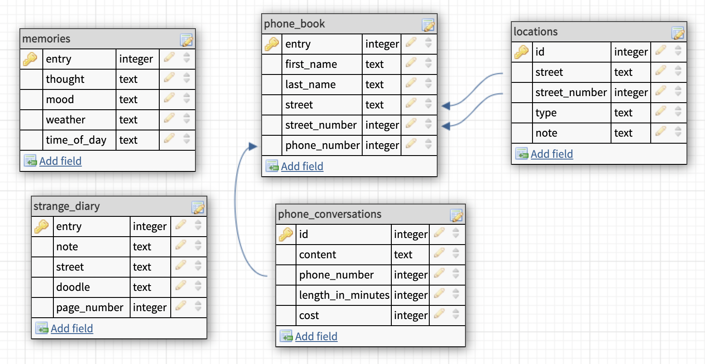

# SQL Mystery

 

## Who are you?

 
You awake encapsulated by snow all around.
You try to remember but everything is blank.
Who are you and why are you lying in this snowdrift?  The only thing in your mind is that you’re <strong>tired</strong> and this <strong>blizzard</strong>
surrounding you. (Maybe you should search deeper in your memory for a clue?)   

How to solve this mystery: 
1. Download the database [here](database.db).  
2. Start by following the clue above.  
3. Make sure to read all information you get, or you might miss something.  
4. In the end you will have to make a loud guess. Hopefully you will have figured it out by then.  
5. It is possible to solve this mystery with seven queries.  
6. Good luck!  

/Albin, Nema and Patrik

DATABASE / TABLE STRUCTURE

